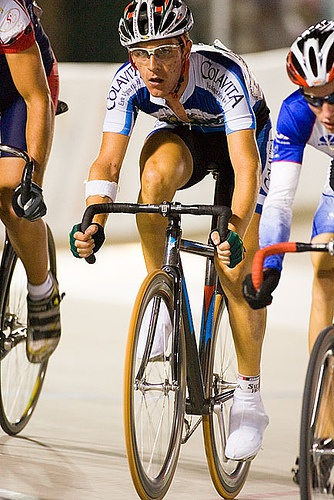

# Keras implementation of [PSPNet(caffe)](https://github.com/hszhao/PSPNet)

Implemented Architecture of Pyramid Scene Parsing Network in Keras.

### Setup
1. Install dependencies:
    * Tensorflow (-gpu)
    * Keras
    * numpy
    * scipy
    * pycaffe(PSPNet)(optional for converting the weights) 
    ```bash
    pip install -r requirements.txt --upgrade
    ```
2. Converted trained weights are needed to run the network.
Weights(in ```.npy``` format) have to be downloaded and placed into directory ``` weights/npy ```
\
Already converted weights can be downloaded here:
[pspnet50_ade20k.npy](https://www.dropbox.com/s/ms8afun494dlh1t/pspnet50_ade20k.npy?dl=0) [pspnet101_cityscapes.npy](https://www.dropbox.com/s/b21j6hi6qql90l0/pspnet101_cityscapes.npy?dl=0) [pspnet101_voc2012.npy](https://www.dropbox.com/s/xkjmghsbn6sfj9k/pspnet101_voc2012.npy?dl=0)
Weights are **automatically** converted to the ```json/h5``` format on **first start**
\
(*optional*)If you want to convert by yourself original caffemodel, it can be converted with ```weight_converter.py``` 
Running this needs the compiled original PSPNet caffe code and pycaffe.
    ```bash
    python weight_converter.py <path to .prototxt> <path to .caffemodel>
    ```
## Usage:

```bash
python pspnet.py -m <model> -i <input_image>  -o <output_path>
python pspnet.py -m pspnet101_cityscapes -i example_images/cityscapes.png -o example_results/cityscapes.jpg
python pspnet.py -m pspnet101_voc2012 -i example_images/pascal_voc.jpg -o example_results/pascal_voc.jpg
```
List of arguments:
```bash
 -m --model        - which model to use: 'pspnet50_ade20k', 'pspnet101_cityscapes', 'pspnet101_voc2012'
    --id           - (int) GPU Device id. Default 0
 -s --sliding      - Use sliding window
 -f --flip         - Additional prediction of flipped image
 -ms --multi_scale - Predict on multiscale images
```
## Keras results:





## Implementation details
* The interpolation layer is implemented as custom layer "Interp"
* Forward step takes about ~1 sec on single image
* Memory usage can be optimized with:
    ```python
    config = tf.ConfigProto()
    config.gpu_options.per_process_gpu_memory_fraction = 0.3 
    sess = tf.Session(config=config)
    ```
* ```ndimage.zoom``` can take a long time


